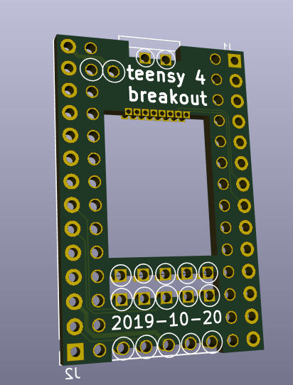
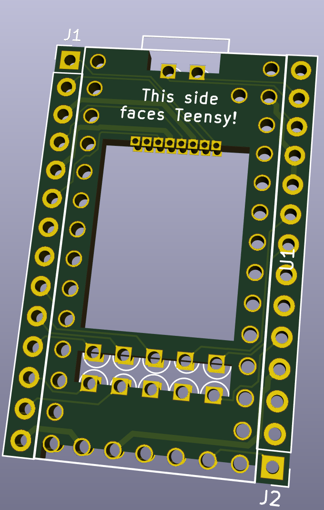

A breakout board for the PJRC.com Teensy 4.0 board that is soldered directly to the bottom of the Teensy board via castellated solder points and two parallel 2x14 0.1" headers for connection.

There are companion boards that can attach to the outside pins and provide:

- [Micro SD Slot Sidecar](https://github.com/blackketter/teensy4_sd_breakout)
- [USB Host Sidecar](https://github.com/blackketter/teensy4_usb_host_breakout)
- [ESP32 WiFi & Bluetooth Sidecar](https://github.com/blackketter/teensy4_esp32_breakout)

Designed in KiCad.

Current design:

Previous prototype:

Notes:

- If you need to cut the trace between VIN and VUSB, do it before attaching board.
- You should be able to use one of [these](https://www.pjrc.com/store/cable_usb_host_t36.html) cables connected to pins 1-5 on the right side for a basic USB host connection (albeit without power management and protection). For a better protected solution see [this USB sidecar](https://github.com/blackketter/teensy4_usb_host_breakout)
- Make sure to solder all the pins marked with circles.  You may need a bit of wire to make the connection on the Teensy VUSB pin.
- When soldering the Teensy pins, make sure you give them plenty of solder, heat and time for the solder to flow to the other side.  And make sure you test the connections with a continuity tester for opens ans shorts
- A thinner PCB will make it easier to solder. (Caution: OSHPark 0.8mm thick boards are not being made reliably.  Better to use 1.6mm process.)

Left Side Pinout:

1. 34/SD DAT1
2. 35/SD DAT0
3. GND
4. 36/SD CLK
5. 3.3V
6. 37/SD CMD
7. 38/SD DAT3
8. 39/SD DAT2
9. 29
10. 31
11. 33
12. 32
13. 30
14. VBAT

Right Side Pinout:

1. VUSB
2. USB Host D-
3. USB Host D+
4. GND
5. GND
6. 27
7. 25
8. 26
9. 28
10. 24
11. 3V3
12. GND
13. Program
14. On/Off
