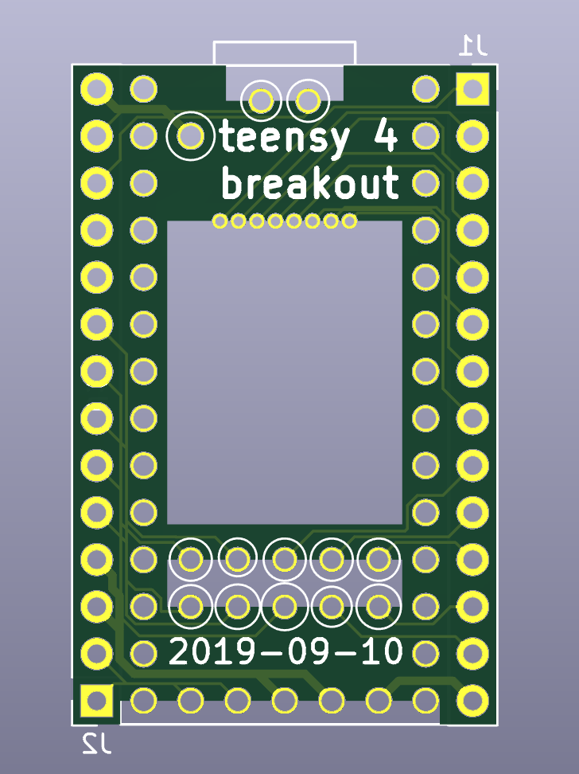
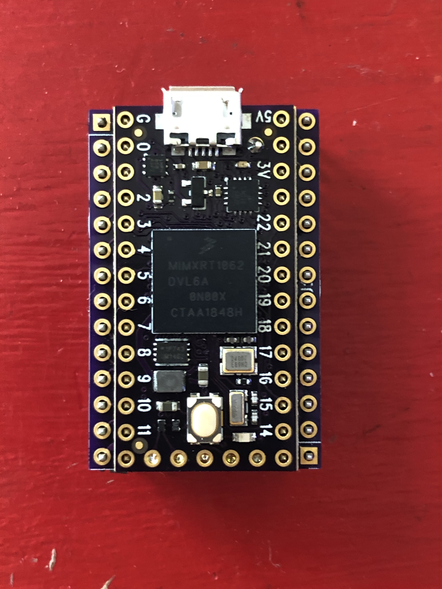
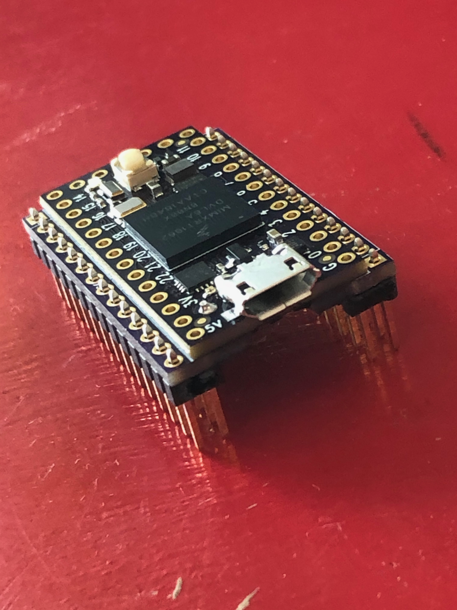

A breakout board for the PJRC.com Teensy 4.0 board that is soldered directly to the bottom of the Teensy board via castellated solder points and two parallel 2x14 0.1" headers for connection.

There's a companion [SD breakout board](https://github.com/blackketter/teensy4_sd_breakout) that can attach to this board.

Designed in KiCad.

Notes:

- First boards came in, seem to work well.
- A thinner PCB will make it easier to solder.
- If you need to cut the trace between VIN and VUSB, do it before attaching board.
- You should be able to use one of [these](https://www.pjrc.com/store/cable_usb_host_t36.html) cables connected to pins 1-5 on the right side for a basic USB host connection (albeit without power management and protection)
- The Teensy's VUSB pin needs to be soldered on both sides with a bit of wire in the middle.
- When soldering the Teensy pins, make sure you give them plenty of solder, heat and time for the solder to flow to the other side.  And make sure you test the connections with a continuity tester.

Left Side Pinout:

1. 34/SD DAT1
2. 35/SD DAT0
3. GND
4. 36/SD CLK
5. 3.3V
6. 37/SD CMD
7. 38/SD DAT3
8. 39/SD DAT2
9. 29
10. 31
11. 33
12. 32
13. 30
14. VBAT

Right Side Pinout:

1. VUSB
2. USB Host D-
3. USB Host D+
4. GND
5. GND
6. 27
7. 25
8. 26
9. 28
10. 24
11. 3V3
12. GND
13. Program
14. On/Off
